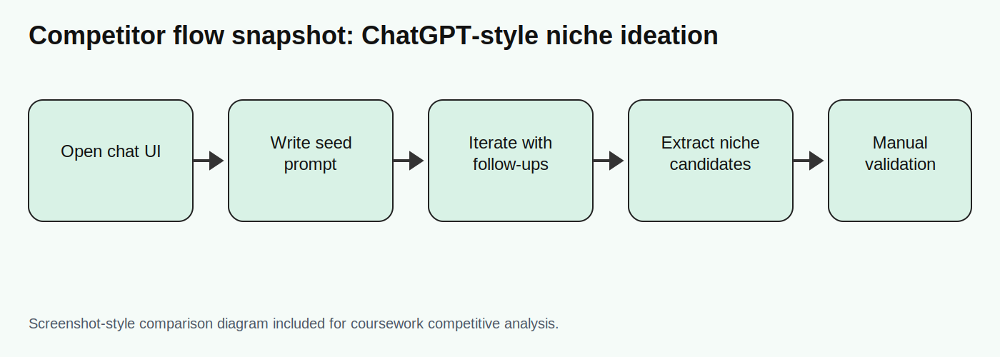
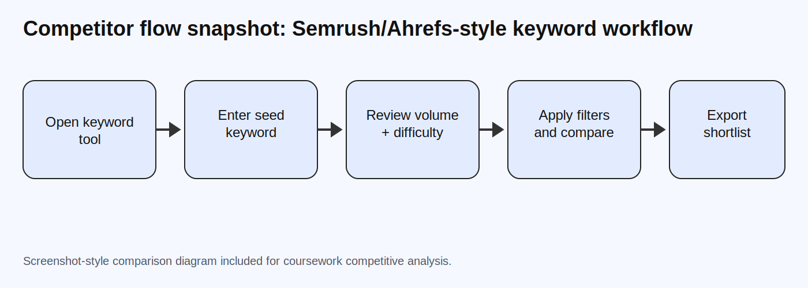

# Competitive analysis: niche-discovery and ideation tools

_Last updated: 2026-04-21_

This review compares tools people often use for the same early-stage "find a niche" job that NicheFind targets.

## Comparison criteria

For each product:
- what it does
- who it's for
- pricing
- what it does well
- where it falls short
- how NicheFind is different

---

## 1) ChatGPT

- **What it does:** General-purpose conversational AI for brainstorming, writing, research, and ideation.
- **Who it's for:** Broad audience (students, creators, founders, marketers, developers).
- **Pricing:** Free tier + paid tiers (Plus / Pro / Team / Enterprise).
- **What it does well:** Fast ideation, strong language quality, flexible follow-up conversation.
- **Where it falls short:** Requires good prompting to avoid generic niche suggestions; no built-in niche-specific structure or validation workflow.
- **How NicheFind is different:** NicheFind starts with a guided niche questionnaire and returns constrained niche candidates with rationale, so beginners do not need prompt-engineering skill.

## 2) Claude

- **What it does:** General-purpose AI assistant focused on conversational reasoning and long-context responses.
- **Who it's for:** Knowledge workers, students, founders, and creators who want long-form collaborative brainstorming.
- **Pricing:** Free tier + paid plans (Pro / Team / Enterprise).
- **What it does well:** Strong long-context conversation; useful for refining ideas and critique.
- **Where it falls short:** Like other general chat tools, output quality depends heavily on prompt quality and user iteration.
- **How NicheFind is different:** NicheFind narrows the task to niche discovery only, with fixed input steps that reduce user ambiguity and improve output consistency.

## 3) Gemini

- **What it does:** General-purpose AI assistant integrated across Google products for ideation, writing, and analysis.
- **Who it's for:** General users and Google ecosystem users.
- **Pricing:** Free tier + paid Google AI tiers.
- **What it does well:** Convenient access and multimodal support in one tool.
- **Where it falls short:** Not specialized for creator niche discovery; users must define framing and evaluation criteria themselves.
- **How NicheFind is different:** NicheFind is intentionally opinionated around creator/business niche selection, with outputs formatted for immediate action.

## 4) Ahrefs

- **What it does:** SEO and keyword research platform (keyword volume, competition, SERP analysis, backlink data).
- **Who it's for:** SEO professionals, agencies, content teams, advanced marketers.
- **Pricing:** Paid subscription SaaS (no true full-feature free tier).
- **What it does well:** Rich keyword and SERP data for evaluating known topics.
- **Where it falls short:** Expensive for beginners; workflow assumes users already have seed topics and SEO knowledge.
- **How NicheFind is different:** NicheFind is discovery-first for users who do **not** yet know their market lane; it optimizes for clarity and speed instead of deep SEO depth.

## 5) Semrush

- **What it does:** All-in-one SEO/marketing intelligence suite (keyword research, domain analysis, content/ads insights).
- **Who it's for:** Marketers, growth teams, agencies, and SEO-heavy businesses.
- **Pricing:** Paid subscription plans; trial-limited access.
- **What it does well:** Comprehensive market/keyword tooling and benchmark data.
- **Where it falls short:** Broad and complex interface for users at the ideation stage; cost can be high for students/solo creators.
- **How NicheFind is different:** NicheFind strips the flow down to a beginner-friendly ideation path and focuses only on choosing a direction.

## 6) Exploding Topics

- **What it does:** Trend discovery tool surfacing rising topics, products, and market themes.
- **Who it's for:** Marketers, investors, founders, and content strategists tracking trend momentum.
- **Pricing:** Free limited access + paid plans.
- **What it does well:** Good for top-down trend spotting and early signal discovery.
- **Where it falls short:** Trend lists are not the same as personalized niche selection; users still need to map trends to their skills/time/goals.
- **How NicheFind is different:** NicheFind is bottom-up and personal: it starts from user constraints and suggests niches that fit individual context.

## 7) AnswerThePublic

- **What it does:** Search-listening and question clustering around keywords (question, preposition, comparison queries).
- **Who it's for:** Content marketers and SEO writers planning topic clusters.
- **Pricing:** Free limited searches + paid tiers.
- **What it does well:** Excellent for content-angle expansion around a known keyword.
- **Where it falls short:** Requires an initial keyword/domain idea; does not generate end-to-end niche direction on its own.
- **How NicheFind is different:** NicheFind helps users arrive at the niche itself before they need keyword cluster tooling.

---

## Competitor flow screenshots (for comparison)

### Snapshot A: general chatbot ideation flow (ChatGPT-like)

### Snapshot B: keyword platform research flow (Semrush/Ahrefs-like)

---

## Positioning: where NicheFind fits

NicheFind sits between generic chat assistants and heavyweight SEO suites. General chat tools are flexible but require prompting skill; SEO suites are powerful but costly and optimized for users who already know their lane. NicheFind targets the underserved first step: helping beginners and early creators choose a viable niche quickly through a guided, low-friction flow with structured outputs.
